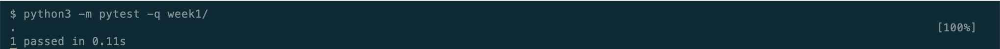

# AMAT5315 2026 Fall Exercises

This repository contains my weekly exercises for AMAT5315, Fall 2026.

## Install pytest

```bash
python3 -m pip install pytest
```

## Run the Week 1 test

```bash
python3 -m pytest week1/
```



The screenshot shows the Week 1 test completing with `1 passed`.
