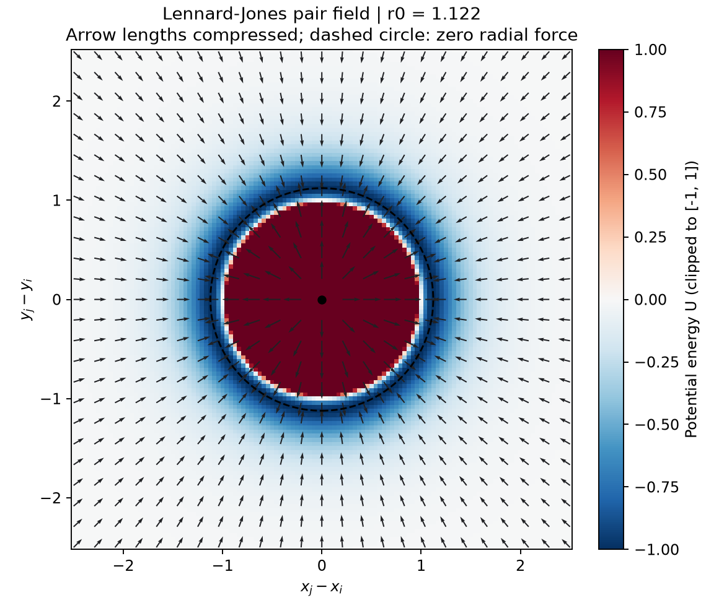

# Week 2: Agentic coding with Rust

This is the same course repository as Week 1. All commands below start in `week2/` unless stated otherwise.

## Current status

Work is in progress. Development evidence is separate from the student's independent grey-box checks. Nothing marked pending below is claimed to have passed.

## Setup

Rust and Cargo are required. Plotting and video dependencies are isolated:

```sh
python3 -m venv .venv
.venv/bin/python -m pip install -r requirements.txt
```

`requirements-lock.txt` records the versions used for the supplied figures. It is a dependency record, not a physics acceptance result.

## Part 1: Rust ABC

At commit `0e8b72a`, `cargo run` prints `Hello, world!` and the library has one passing test. The executable and test call the same `greeting` function. Development red/green/run transcripts are in `evidence/part1-*.txt`.

The owning struct is responsible for particle arrays. A shared borrow permits reading while a mutable borrow permits exclusive updates. The compiler checks types and borrowing; physical tests must check the update rule.

## Part 2: a tested force

`md::pair::energy` implements U(r)=4(r^-12-r^-6). `md::pair::force` independently implements F(r)=24(2r^-12-r^-6)/r. The force is positive for repulsion. Both functions require positive finite separations.

The well-depth test fixes the scale at U(2^(1/6))=-1. A central-difference energy derivative tests the analytic force at seven distances on both sides of the minimum, with h=1e-5 and tolerance 1e-6*max(1,abs(F)). The derivative is the test's independent calculation, not the force implementation.

Red commit: `9bfa536`; energy implementation: `4ab83a6`; force implementation and all-green pair tests: `06240f6`.

Reproduce `field.png` using the actual Rust functions:

```sh
cargo run --manifest-path md/Cargo.toml --example field > field.csv
.venv/bin/python scripts/plot_field.py field.csv --out field.png
```



Arrows point outwards inside r0 and inwards outside; the attractive energy well surrounds the repulsive core. Arrow lengths are compressed for visibility.

## Design and workflow

The student approved the Part 3-5 design and ordered plan on 2026-09-09. They are under `../docs/superpowers/`. The four repository skills come from [obra/superpowers](https://github.com/obra/superpowers), installed with the Codex skill-installer. All four entrypoints were byte-compared against revision `b36e0829c6d0140e93cfef2ca599b1b07d4a7797`; the upstream MIT license is retained in `.agents/skills/SUPERPOWERS-LICENSE` at repository root. Existing repository and host instructions remain controlling.

## Sources

- Week 2 learning sheet, pages 1-20, supplied by the student.
- [The Rust Programming Language](https://doc.rust-lang.org/book/): sections 4.2, 10.2, 11.1.
- [Course trajectory viewer](https://giggleliu.github.io/AMAT5315-2026Fall/week2-viewer.html).
- Supplied NumPy baseline: `/Users/joshua/Downloads/week2-sim.py`, unchanged, seed 42. The Rust contract requires seed 2026; this seed difference will be disclosed in timing comparisons.
