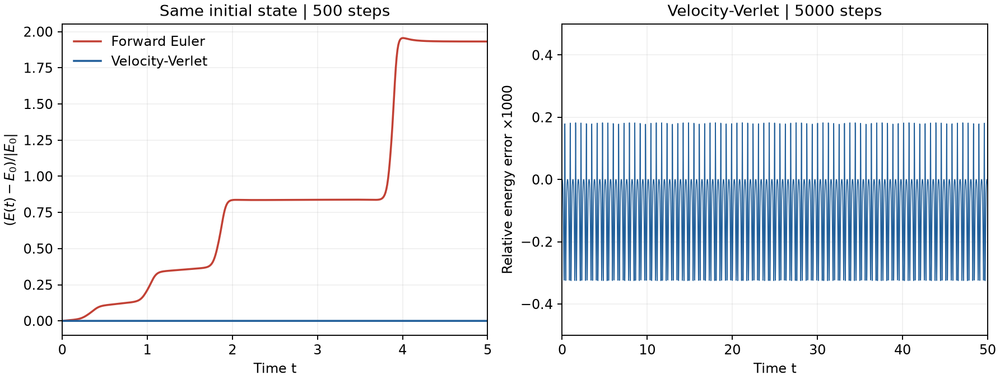
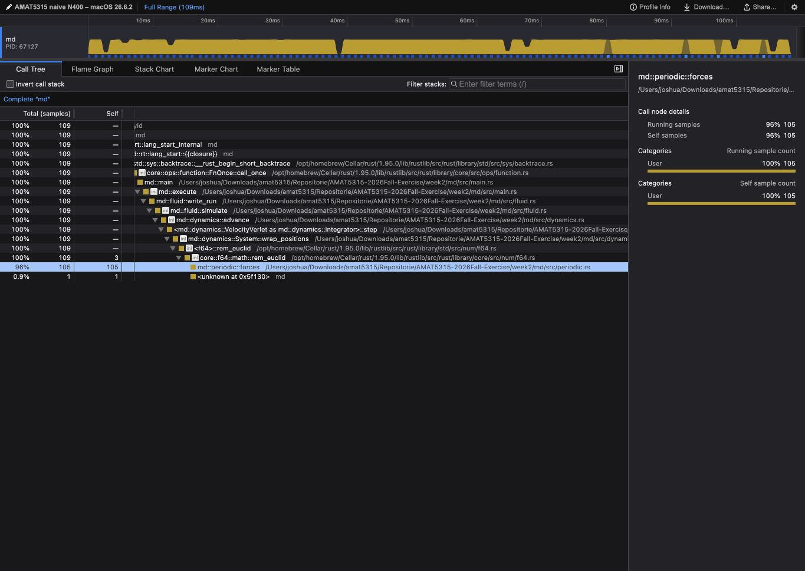
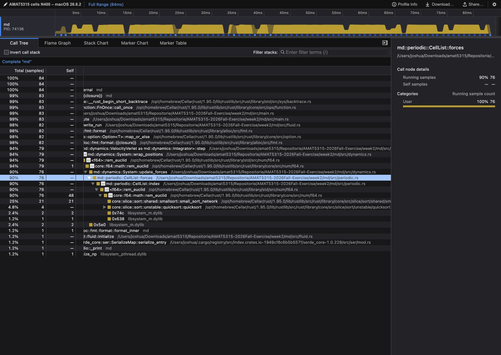
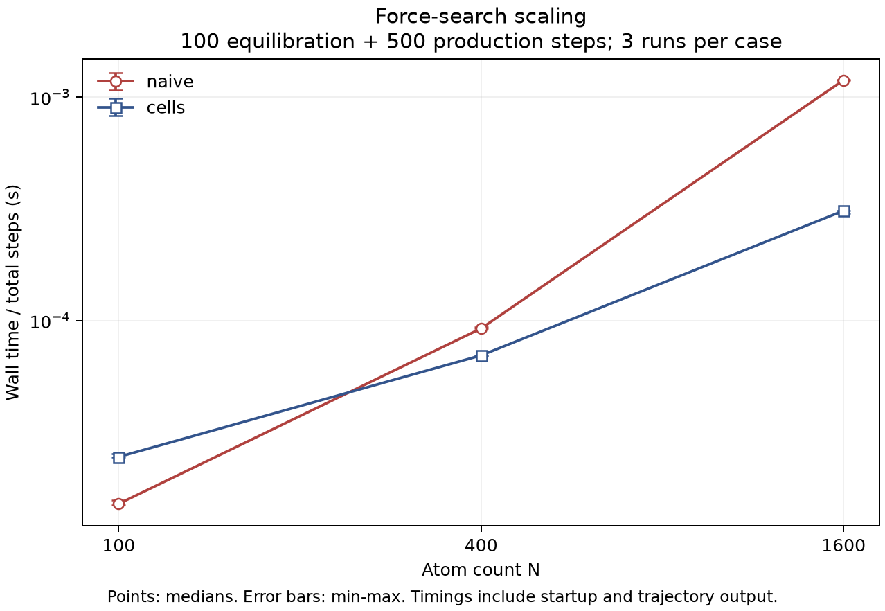
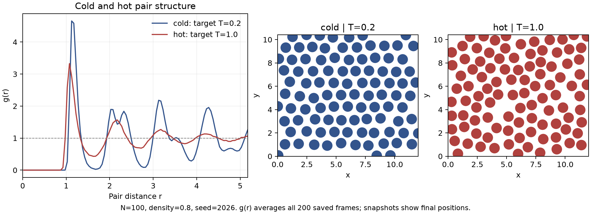

# Week 2: Agentic coding with Rust

This is the same course repository as Week 1. All commands below start in `week2/` unless stated otherwise.

## Current status

Parts 1-5 are implemented; all 21 release tests and the physics check pass from a fresh GitHub clone. Timing/profile/scaling/heating evidence and the final independent review are complete. The public heating page and the 110-second silent browser-screen demonstration are published. The student delegated terminal verification and requested no narration; execution and capture methods are documented honestly. See [MANUAL-CHECKS.md](MANUAL-CHECKS.md) for reproduction and [REVIEW.md](REVIEW.md) for the resolved findings.

## Setup

Rust and Cargo are required. Plotting and video dependencies are isolated:

```sh
python3 -m venv .venv
.venv/bin/python -m pip install -r requirements.txt
cargo install --path md --locked --force
export PATH="$HOME/.cargo/bin:$PATH"
command -v md
md --version
```

Install from this checkout before using bare `md` in the profiling/heating commands. `--force` replaces a stale installation, and the PATH line selects Cargo's installed command. The commands using `cargo run --manifest-path md/Cargo.toml` already select this checkout explicitly.

`requirements-lock.txt` records the versions used for the supplied figures. It is a dependency record, not a physics acceptance result.

## Part 1: Rust ABC

At commit `0e8b72a`, `cargo run` prints `Hello, world!` and the library has one passing test. The executable and test call the same `greeting` function. Development red/green/run transcripts are in `evidence/part1-*.txt`.

The owning struct is responsible for particle arrays. A shared borrow permits reading while a mutable borrow permits exclusive updates. The compiler checks types and borrowing; physical tests must check the update rule.

## Part 2: a tested force

`md::pair::energy` implements U(r)=4(r^-12-r^-6). `md::pair::force` independently implements F(r)=24(2r^-12-r^-6)/r. The force is positive for repulsion. Both functions require positive finite separations.

The well-depth test fixes the scale at U(2^(1/6))=-1. A central-difference energy derivative tests the analytic force at seven distances on both sides of the minimum, with h=1e-5 and tolerance 1e-6*max(1,abs(F)). The derivative is the test's independent calculation, not the force implementation.

Red commit: `9bfa536`; energy implementation: `4ab83a6`; force implementation and all-green pair tests: `06240f6`.

Reproduce `field.png` using the actual Rust functions:

```sh
cargo run --manifest-path md/Cargo.toml --example field > field.csv
.venv/bin/python scripts/plot_field.py field.csv --out field.png
```


Arrows point outwards inside r0 and inwards outside; the attractive negative-energy ring surrounds the repulsive core. All arrows are normalized to the same displayed length (0.17 distance units) and show direction only, not force magnitude. White arrows remain visible inside the repulsive core, dark arrows make the weak outer attraction readable, and a small arrow-free band leaves the zero-force circle visible. The energy heatmap uses a 241×241 grid exported by the Rust functions.

## Part 3: from force to motion

`System` owns position, velocity, and acceleration vectors. `total_energy(&self)` only reads them. `Integrator::step(&self, system: &mut System, dt)` borrows the update rule for reading and the particle state exclusively for updates. The generic `advance` driver accepts either `ForwardEuler` or `VelocityVerlet`, so the experiment changes only the integrator value.

Euler updates position from the old velocity and velocity from the old acceleration. Verlet applies a half kick, drift, one force evaluation at the new positions, and a second half kick, retaining the new accelerations. `println!` is a formatting/output macro; `assert!` checks test conditions; `#[test]` is the attribute that registers tests.

For initial positions (0,0),(1.2,0), zero velocities, and dt=0.01, development measurements gave Euler's final relative energy error 1.931776 after 500 steps; Verlet's maximum absolute relative error was 0.000325048. The 5000-step Verlet maximum was 0.000325049, below 1e-3. Small bounded energy oscillations do not mean the numerical trajectory is exact.

```sh
cargo run --manifest-path md/Cargo.toml --example dimer > dimer.csv
.venv/bin/python scripts/plot_dimer.py dimer.csv --out dimer.png
```



The plot matches the PDF's display sampling: every 2 integration steps in the left panel and every 10 in the right. All 5000 integration steps remain in the CSV and conservation tests. Connecting every step makes the dense periodic waveform look different from the PDF's coarser, aliased display; it is the same trajectory. An optional full-resolution view is reproducible with `scripts/plot_dimer.py dimer.csv --full-resolution --out evidence/dimer-full-resolution.png` using the environment's Python.

The PDF comparison is documented in `evidence/dimer-pdf-comparison.json`. Its right-hand vector path contains 500 points; converting those points back using the printed axes and comparing with the Rust CSV at steps 10,20,...,5000 gives agreement at approximately 1e-9 in relative energy. The caption's “within +/-3e-4” is approximate: the actual full-series bound is 3.2505e-4, while the sheet's required test threshold is 1e-3. No energies were clipped or rescaled to force the caption's rounded number.

The test and example both route through `advance(&impl Integrator, ...)`, with no integrator-specific experimental setup. Raw development test output is in `evidence/part3-green.txt`. Student verification remains separate.

## Part 4: equilibrium CLI

`md run` implements the PDF's default contract: N=100, rho=0.8, T=0.5, dt=0.01, 2000 equilibration steps, 10000 production steps, sample every 50, seed 2026, velocity-Verlet. The initial triangular lattice uses periodic minimum-image separations and the energy-shifted cutoff rc=2.5. The force is unchanged inside the cutoff and zero outside; it is not force-shifted. The isolated dimer retains open boundaries and the plain LJ potential.

Random velocities use the pinned rand_distr Normal sampler and ChaCha8Rng seeded with 2026. They have independent Gaussian components, their centre-of-mass velocity is removed, and velocities are rescaled initially and every 50 equilibration steps using T_thermo=2K/(2N-2). Ordinary production never rescales velocities. Its measured T_speed=<v^2>/2 differs from T_thermo by the finite-size factor (N-1)/N.

```sh
make reproduce
cargo run --manifest-path md/Cargo.toml --release -- check artifacts
cargo run --manifest-path md/Cargo.toml --release -- video artifacts --out fluid.mp4
```

These commands are for the student's independent check. The default trajectory has 200 frames, steps 50 through 10000. run.json records every required parameter; traj.jsonl records wrapped positions, velocities, times and energies with full JSON floating-point precision. Repeated runs preserve previous run.json/traj.jsonl under the output directory's history/ before installing a completed new run. Failed simulations do not replace the active trajectory.

`md check` validates metadata and frame structure, recomputes forces/energy from positions with the naive path, recomputes kinetic energy and speeds from velocities, and only then cross-checks stored energies. It exits nonzero on malformed files or failed physics. The fixed acceptance bounds are the sheet's unheated T=0.5 contract: early/late 10% mean-energy drift <2e-3; abs(T_speed-0.5)<0.05; chi2/22<2 using 24 equal-predicted-probability bins. They are not a general acceptance test for cold or heated trajectories.

Development values: drift 9.82785e-5, T_speed 0.47705724, chi2/22 0.70185455. An independent NumPy calculation reproduced these quantities and found maximum energy discrepancy 5.12e-13. See `evidence/development-review-parts1-4.md` for its scope and the fixed input-validation finding. These are development results, not student-submitted evidence.

`md video` validates the raw trajectory and renders positions beside g(r), using recent 20-frame averages, one output frame per saved frame. The Python helper is embedded in the installed binary. It uses `MD_PYTHON` if set, otherwise the build workspace's `.venv/bin/python`, then python3. The encoder is `MD_FFMPEG`, ffmpeg on PATH, or the imageio-ffmpeg packaged executable. Default videos use 20 fps and enforce the <2 MB bound.

The unchanged supplied viewer is available at `support/week2-viewer.html`; drop both output files into it. The same viewer and the heating trajectory are staged in `../docs/` for GitHub Pages.

## Timing

Measured before the cell list, at source commit efda417, three runs per program. Each run includes startup, 2000 equilibration + 10000 production steps, and trajectory output. NumPy 2.5.3 uses the unchanged supplied seed-42 program; Rust follows the PDF seed-2026 contract. These are comparable workloads, not identical random trajectories.

| Program | Median (s) | Range: min-max (s) |
| --- | ---: | ---: |
| Supplied NumPy week2-sim.py (seed 42) | 3.051785 | 3.047359-3.058270 |
| Rust debug (seed 2026) | 1.273987 | 1.255990-1.279784 |
| Rust release, naive (seed 2026) | 0.091495 | 0.091437-0.091592 |

The release median is below one third of debug. On this machine release Rust also beat the supplied NumPy baseline; this is measured here, not assumed universally. Full commands, all nine runs, environment and raw output locations are in `evidence/baseline-timings.json`. Reproduce with `python3 scripts/benchmark.py baseline --python /tmp/venv/bin/python --out evidence/baseline-new.json` after building both debug and release. The helper now explicitly chooses --force naive so a changed default cannot silently relabel cell timings. To rerun the exact pre-optimization source, use a separate checkout at efda417.

## Profile

| Version | Force share (%) | Elapsed time (s) |
| --- | ---: | ---: |
| Naive | 96.3303 | 0.110848 |
| Cell list | 91.6667 | 0.084785 |

The naive profile contains 109 weighted samples, 105 with `md::periodic::forces` in their stack (inclusive share). This confirms the >90% force hot spot before optimization. Cells contains 77/84 inclusive force samples: 76 in integration and one in initialization. The main-loop Call Tree row rounds 76/84 to 90%, while the table aggregates the same function across all call sites. Elapsed time is the recorded process lifetime, excluding samply startup; the viewer's sampled ranges are about 109 ms and 84 ms. The cell-list process is faster even though force evaluation still accounts for most samples. Actual profiles, symbol sidecars and summaries are under `evidence/profile-*`; screenshots are `profile-naive.png` and `profile-cells.png`.

| Naive profiler | Cell-list profiler |
| --- | --- |
|  |  |

```sh
~/.cargo/bin/samply record --save-only --unstable-presymbolicate --output evidence/profile-naive-new.json.gz md run --force naive --n 400 --eq-steps 200 --steps 1000 --out /tmp/md-prof
python3 scripts/profile_summary.py evidence/profile-naive-new.json.gz --symbols evidence/profile-naive-new.json.syms.json --out evidence/profile-naive-new-summary.json
~/.cargo/bin/samply load evidence/profile-naive-new.json.gz
~/.cargo/bin/samply record --save-only --unstable-presymbolicate --output evidence/profile-cells-new.json.gz md run --force cells --n 400 --eq-steps 200 --steps 1000 --out /tmp/md-prof
python3 scripts/profile_summary.py evidence/profile-cells-new.json.gz --symbols evidence/profile-cells-new.json.syms.json --out evidence/profile-cells-new-summary.json
~/.cargo/bin/samply load evidence/profile-cells-new.json.gz
```

## Benchmark

Measured at source commit 175ef6e with 100 equilibration + 500 production steps and defaults otherwise, three runs per case:

| N | Naive median [min-max] (s) | Cells median [min-max] (s) | Speedup [range] |
| ---: | ---: | ---: | ---: |
| 100 | 0.009078 [0.008980-0.009442] | 0.014727 [0.014629-0.015243] | 0.616x [0.589-0.645] |
| 400 | 0.055338 [0.055267-0.056033] | 0.041920 [0.041496-0.041968] | 1.320x [1.317-1.350] |
| 1600 | 0.715145 [0.711777-0.716171] | 0.186157 [0.180998-0.186715] | 3.842x [3.812-3.957] |

Speedup is the ratio of medians; its range is [min(naive)/max(cells), max(naive)/min(cells)]. At N=100 the cell bookkeeping and candidate sorting cost more than the saved distance checks; the measured speedup grows with N and exceeds 2 at N=1600. Naive searches N(N-1)/2 pairs, while a fixed-density cell grid keeps candidates per atom bounded, explaining the shallower scaling curve.

```sh
python3 scripts/benchmark.py scaling --out evidence/scaling-new.json
.venv/bin/python scripts/plot_scaling.py evidence/scaling-timings.json --out scaling.png
```



## Part 5: heating and structure

`--force cells` is the default, with `--force naive` retained. Cells use floor(L/rc) divisions per axis, wrapped/deduplicated neighbouring-cell indices, and each unordered pair once. Candidate atom IDs are sorted to retain the naive summation order. The allocations and neighbour-cell map are reused. Tests cover perturbed lattices, boundary pairs, cutoff cases and a two-cell-wide box; every earlier test remains in the suite.

`--ramp-to` raises the production target linearly from the initial temperature at step 0 to its final value at the last step. Velocities are rescaled every 50 production steps and at the last step if needed; unheated production remains unchanged. The target is recorded in run.json. `md check` explicitly refuses heated data because the contract's energy-conservation gate applies to the unheated default experiment.

From the repository root, reproduce the heating page and the two fixed-temperature videos:

```sh
md run --n 400 --temperature 0.2 --ramp-to 1.2 --steps 20000 --sample-every 100 --out docs
md run --temperature 0.2 --out /tmp/cold
md video /tmp/cold --out week2/cold.mp4
md run --temperature 1.0 --out /tmp/hot
md video /tmp/hot --out week2/hot.mp4
```

The saved heating run has 400 atoms and 200 frames. Its first/last measured T_speed values are 0.20449 and 1.1970 (the first saved step is 100; T_speed also includes the N-1 degrees-of-freedom factor). The viewer-defined long-range contrast falls from 0.3330 to 0.0960. Low-temperature atoms remain near lattice sites; the cold/hot mean-square displacements over the saved interval are 0.0317 and 23.3242. The hot g(r) has much weaker distant shell peaks; this is the evidence for loss of crystalline order, rather than simply faster animation.

Both fixed-temperature videos contain 200 frames at 20 fps: cold.mp4 is 935246 bytes and hot.mp4 is 918413 bytes. A supporting comparison is below; its curves average all 200 frames, whereas the supplied viewer uses a 10-frame g(r) window.



From week2, reproduce the supporting figure and metrics after the commands above:

```sh
.venv/bin/python scripts/inspect_structure.py --heating ../docs --cold /tmp/cold --hot /tmp/hot --figure structure.png
```

Actual run-output receipts and the isolated temporary cold/hot data locations used here are recorded in `evidence/*-run.txt`, `evidence/*-video.txt`, and `evidence/structure-analysis.json`. The commands above reproduce the experiments in new local output directories.

## Pages and recording

Public heating viewer: [GitHub Pages](https://tracer-huang.github.io/AMAT5315-2026Fall-Exercise/) · [Silent screen demonstration, 110 seconds](https://github.com/Tracer-Huang/AMAT5315-2026Fall-Exercise/releases/download/week2-md/week2-silent-screen-demo.mp4) · [GitHub Release](https://github.com/Tracer-Huang/AMAT5315-2026Fall-Exercise/releases/tag/week2-md).

The site is published from main:/docs and serves the supplied viewer with the 400-atom, 200-frame heating trajectory. Anonymous HTTP access and all four browser panels were verified. Browser-visible cold / near-T=1 / final states are recorded in `evidence/page-verification.json` and actual `page-*.png` screenshots.

The screen demonstration is silent at the student's request. It shows actual fresh-shell verification output in a read-only browser panel, followed by the public viewer. Captures remain in chronological order and are uniformly time-compressed by about 9.05x to 110 seconds. This capture method is documented in `evidence/screen-demo.json`; it is not described as a native desktop screencast. The MP4 and original captures are retained locally under ignored `recordings/`. The MP4 is attached to the GitHub release and is not committed to git; GitHub's uploaded SHA-256 matches the local file (`evidence/release.json`).

Fresh-clone verification receipts are `evidence/fresh-clone-tests.txt`, `fresh-clone-reproduce.txt`, and `fresh-clone-check.txt`. The code reviewed/tested at 44a49f4 remains unchanged; documentation findings were fixed at 64245ae.

## Design and workflow

The student approved the Part 3-5 design and ordered plan on 2026-09-09. They are under `../docs/superpowers/`. The four repository skills come from [obra/superpowers](https://github.com/obra/superpowers), installed with the Codex skill-installer. All four entrypoints were byte-compared against revision `b36e0829c6d0140e93cfef2ca599b1b07d4a7797`; the upstream MIT license is retained in `.agents/skills/SUPERPOWERS-LICENSE` at repository root. Existing repository and host instructions remain controlling.

## Sources

- Week 2 learning sheet, pages 1-20, supplied by the student.
- [The Rust Programming Language](https://doc.rust-lang.org/book/): sections 4.2, 10.2, 11.1.
- [Course trajectory viewer](https://giggleliu.github.io/AMAT5315-2026Fall/week2-viewer.html).
- Supplied NumPy baseline: `/Users/joshua/Downloads/week2-sim.py`, unchanged, seed 42. The Rust contract requires seed 2026; this seed difference will be disclosed in timing comparisons.
